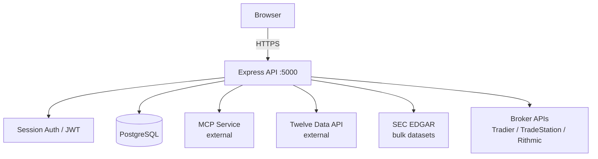
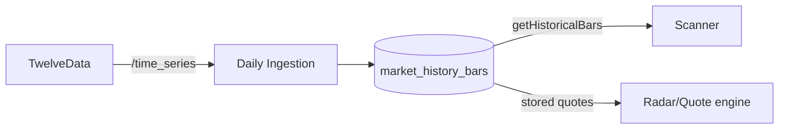

# 01 — System Architecture

## Overview

VCP Trader AI is a full-stack TypeScript application (Express + React + PostgreSQL) deployed on Railway. The system has three logical tiers:

1. **Client** — Vite/React SPA (served by Express in production)
2. **Server** — Express API, background jobs, MCP client
3. **Data** — PostgreSQL (Drizzle ORM), external MCP service, SEC datasets

---

## Request Paths



---

## Data Pipeline — Market Intelligence

```mermaid
flowchart LR
    MCP -->|scan_vcp| Scanner
    Scanner -->|candidates| Ranking[Opportunity Ranking Engine]
    Ranking -->|RankedOpportunityRanking| InMemory[/getLatestRanking/]
    InMemory --> ChangeIntel[Change Intelligence]
    InMemory --> IntelOrch[Intelligence Orchestrator]
    IntelOrch --> SectorEngine[Sector Intelligence Engine]
    IntelOrch --> ThemeEngine[Theme Intelligence Engine]
    SectorEngine --> SectorSnap[(sector_intelligence_snapshots)]
    ThemeEngine --> ThemeSnap[(theme_intelligence_snapshots)]
    SectorSnap & ThemeSnap --> Briefing[/api/intelligence/briefing]
    Briefing --> ResearchHub[/research]
    Briefing --> IntelDash[/intelligence]
```

**Key:** Ranking is in-memory. Snapshots are persisted. Both are lost on restart until next scan cycle, except snapshots (PostgreSQL).

---

## Data Pipeline — SEC 13F Institutional

```mermaid
flowchart LR
    SEC[SEC EDGAR\nbulk ZIP] -->|catalog| Parser[13F Bulk Parser]
    Parser --> Filings[(institutional_filings)]
    Parser --> Holdings[(institutional_holdings)]
    Parser --> Coverpage[(via COVERPAGE.tsv)]
    Holdings --> SecurityMaster[(security_master\n+institutionalSecurityMappings)]
    SecurityMaster -->|reviewed mappings| Signals[Signal Engine]
    Signals --> ISS[(institutional_symbol_signals)]
    ISS --> Ranking
    ISS --> FundExplorer[/institutional/funds]
    ISS --> ResearchPackage[/opportunities/:symbol]
```

---

## Data Pipeline — Market History



**Rule:** `getHistoricalBars()` in `market-history-service.ts` is the **sole entry point** for historical data. Never bypass it.

---

## Synchronous vs. Background

| Path | Type |
|------|------|
| `/api/intelligence/briefing` | Synchronous read (precomputed) |
| `/api/opportunities/latest` | Synchronous read (precomputed) |
| Scanner → Ranking | Background job (scheduled) |
| Intelligence precomputation | Fire-and-forget after ranking |
| 13F ingestion | Long-running background job |
| Symbol enrichment | Admin-triggered background job |
| Market history ingestion | Scheduled background job |

---

## Admin Surfaces

| URL | Purpose |
|-----|---------|
| `/admin` | Admin home |
| `/admin/platform-health` | System health dashboard |
| `/admin/users` | User management |
| `/admin/market-data` | Ingestion control, credits |
| `/admin/institutional-mappings` | CUSIP→ticker mapping review |
| `/api/admin/intelligence/diagnostics` | Raw JSON diagnostics |
| `/api/admin/intelligence/rebuild` | Trigger intelligence rebuild |
| `/api/admin/symbols/enrich` | Trigger sector enrichment |
| `/api/admin/platform-health/refresh` | Force health cache refresh |
